# 公司車輛管理系統

> 114-2 逢甲大學 軟體框架設計 期末專題  
> Corporate Vehicle Management System

## 專案成員

| 學號 | 姓名 | 負責範疇 |
|------|------|----------|
| D1210799 | 王建葦 | 系統架構設計、OOD 原則應用、後端 API 實作 |
| D1249623 | 陳稚翔 | 前端 Vue 3 實作、資料庫設計、整合測試 |

---

## 系統簡介

本系統為企業內部車輛借用管理平台，提供完整的車輛申請、審核、出車、還車工作流程，以及車輛保養紀錄管理功能。系統以物件導向設計原則（SOLID、迪米特法則）與多種 GoF 設計模式為核心架構依據。

### 核心功能

| 功能 | 說明 |
|------|------|
| 使用者認證 | JWT 無狀態認證，BCrypt 密碼加密 |
| 車輛管理 | 車輛 CRUD、狀態追蹤（可用 / 使用中 / 維修中） |
| 借車申請 | 時段衝突檢查、申請 → 審核 → 出車 → 還車完整流程 |
| 審核工作流 | 管理員核准 / 拒絕、備注填寫、全部記錄查詢 |
| 保養管理 | 保養紀錄新增 / 查詢、到期日提醒 |
| 違規管理 | 還車超時自動登錄、管理員 / 主管手動登錄（車損、違停、交通違規等） |
| 通知收件夾 | 站內訊息中心 + 未讀狀態燈，借車事件自動通知相關人（Observer Pattern） |
| 稽核日誌 | 借車狀態操作自動記錄並持久化，管理員可查詢（Command Pattern） |
| 帳號安全 | 密碼強度政策、連續登入失敗帳號鎖定 |
| 資料治理 | 車輛軟刪除與還原，保留資料可追溯 |
| 申請維護 | 管理員 / 主管撤銷已核准申請、更改申請內容 |

---

## 技術選型

| 層級 | 技術 | 版本 |
|------|------|------|
| 後端框架 | Spring Boot | 3.3.4 |
| 安全認證 | Spring Security + JJWT | 0.12.6 |
| 資料庫 | PostgreSQL + Spring Data JPA | — |
| DB 遷移 | Flyway | — |
| API 文件 | springdoc-openapi（Swagger UI） | 2.6.0 |
| 健康監控 | Spring Boot Actuator | — |
| 前端框架 | Vue 3 + TypeScript | — |
| 狀態管理 | Pinia | 2.x |
| HTTP 客戶端 | Axios | 1.x |
| 前端建構 | Vite | 5.x |

---

## 系統架構

### 分層架構

```
┌─────────────────────────────────────────────────┐
│  Presentation Layer  (Vue 3 SPA + REST API)     │
│  LoginView / EmployeeBorrowView / Admin Views   │
│  AuthController / VehicleController / ...       │
├─────────────────────────────────────────────────┤
│  Service Layer                                   │
│  BorrowingService / VehicleService /            │
│  MaintenanceService / UserService               │
├─────────────────────────────────────────────────┤
│  Domain Layer                                    │
│  BorrowingRequest (State Pattern)               │
│  Vehicle / User / MaintenanceRecord             │
│  Role / Permission (組合模式)                   │
├─────────────────────────────────────────────────┤
│  Repository Interface Layer (DIP)               │
│  IVehicleRepository / IBorrowingRepository / … │
├─────────────────────────────────────────────────┤
│  Infrastructure Layer                            │
│  JPA Adapters / JWT Security / Flyway Migration │
└─────────────────────────────────────────────────┘
```

### 專案結構

```
├── backend/
│   └── src/
│       ├── main/java/com/vehicle/management/
│       │   ├── api/
│       │   │   ├── controller/      # REST Controllers + GlobalExceptionHandler
│       │   │   └── dto/             # Request / Response records
│       │   ├── domain/
│       │   │   ├── model/           # BorrowingRequest, Vehicle, User, Notification, AuditLog…
│       │   │   ├── state/           # State Pattern: BorrowingState, PendingState, …
│       │   │   ├── role/            # Role, AdminRole, EmployeeRole, ManagerRole, RoleFactory
│       │   │   ├── observer/        # BorrowingEventPublisher, Email/InboxNotificationObserver
│       │   │   ├── strategy/        # ConflictCheckStrategy, StrictOverlapStrategy, BufferedOverlapDecorator
│       │   │   ├── chain/           # Chain of Responsibility: BorrowingValidator 責任鏈
│       │   │   └── command/         # Command Pattern: ApproveCommand, RejectCommand, …
│       │   ├── service/             # BorrowingService, NotificationService, AuditService, LoginAttemptService…
│       │   ├── repository/          # IVehicleRepository, IBorrowingRepository, INotificationRepository…
│       │   │   └── inmemory/        # InMemory 實作（單元測試用）
│       │   └── infrastructure/
│       │       ├── persistence/     # JPA Entities + Repository Adapters
│       │       ├── security/        # JwtUtil, JwtAuthFilter, SecurityConfig
│       │       └── config/          # OpenApiConfig（Swagger UI）
│       └── test/java/com/vehicle/management/
│           ├── unit/                # BorrowingServiceTest, VehicleServiceTest, …
│           └── integration/         # BorrowingControllerTest (WebMvcTest)
└── frontend/
    └── src/
        ├── api/             # auth / vehicles / borrowings / notifications / audit / system…
        ├── stores/          # auth.ts (Pinia)
        ├── router/          # index.ts
        └── views/           # LoginView / EmployeeBorrowView / InboxView / AdminAuditView / …
```

---

## 設計模式應用

本專案實作了 **10 個 GoF 設計模式**，涵蓋 Behavioral、Structural、Creational 三大分類，其中後 4 個（Builder、Chain of Responsibility、Decorator、Command）用於重構既有設計、消除擴充痛點。

| # | 模式 | 分類 | 主要類別 |
|---|------|------|---------|
| 1 | [State](#1-state-pattern--借車申請生命週期) | Behavioral | `BorrowingRequest`, `BorrowingState`, `PendingState`… |
| 2 | [Observer](#2-observer-pattern--借車事件通知) | Behavioral | `BorrowingEventPublisher`, `EmailNotificationObserver`, `InboxNotificationObserver` |
| 3 | [Strategy](#3-strategy-pattern--時段衝突檢查) | Behavioral | `ConflictCheckStrategy`, `StrictOverlapStrategy` |
| 4 | [Template Method](#4-template-method-pattern--服務層權限守衛) | Behavioral | `AbstractProtectedService`, `VehicleService`, `MaintenanceService` |
| 5 | [Factory Method](#5-factory-method-pattern--角色建立) | Creational | `RoleFactory`, `AdminRole`, `EmployeeRole`, `ManagerRole` |
| 6 | [Adapter](#6-adapter-pattern--repository-橋接) | Structural | `*RepositoryAdapter`, `Jpa*Repo` |
| 7 | [Builder](#7-builder-pattern--借車申請物件建構63) | Creational | `BorrowingRequest.Builder` |
| 8 | [Chain of Responsibility](#8-chain-of-responsibility-pattern--借車申請多步驟驗證64) | Behavioral | `BorrowingValidator`, `PermissionValidator`, `TimeConflictValidator` |
| 9 | [Decorator](#9-decorator-pattern--可疊加的衝突緩衝策略65) | Structural | `BufferedOverlapDecorator` |
| 10 | [Command](#10-command-pattern--借車狀態操作稽核66) | Behavioral | `BorrowingCommand`, `BorrowingCommandBus`, `ApproveCommand` |

---

### 1. State Pattern — 借車申請生命週期

**問題**：借車申請有 5 種狀態，每種狀態只允許特定的轉換操作，若用 `if-else` 判斷狀態字串，Service 層會充滿分支邏輯。

**解法**：`BorrowingRequest`（Context）持有 `BorrowingState` 介面，所有狀態轉換邏輯封裝在各 ConcreteState 類別。非法轉換拋出 `InvalidStateTransitionException`（HTTP 422）。

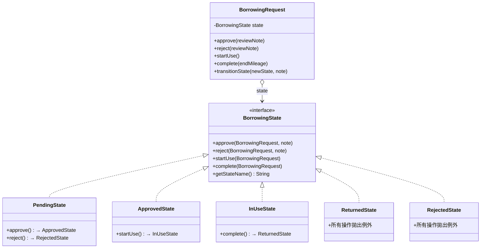

**狀態流轉圖：**

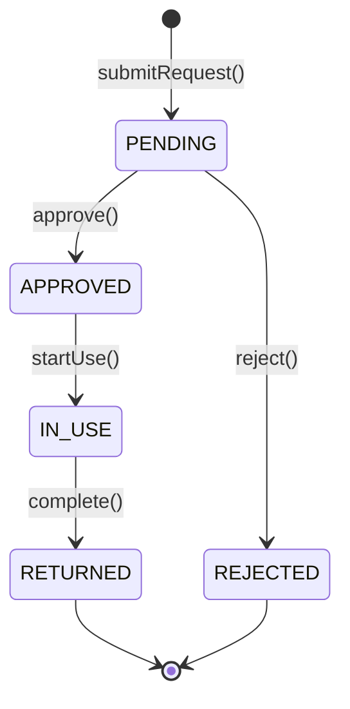

---

### 2. Observer Pattern — 借車事件通知

**問題**：借車申請狀態變更時需通知相關人員，但通知邏輯（Email、簡訊、推播）不應寫死在 Service 內。

**解法**：`BorrowingService` 繼承 `BorrowingEventPublisher`（Subject），Spring 自動注入所有實作 `BorrowingEventObserver` 的 Bean，Service 只呼叫 `notifyApproved()` 等方法，不感知具體通知實作（DIP）。

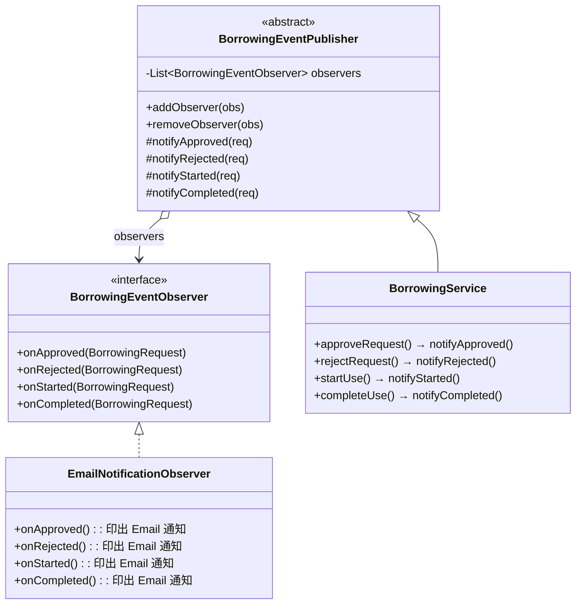

> 新增通知管道（SMS、Line 推播）只需實作 `BorrowingEventObserver` 並標記 `@Component`，Spring 自動注入、無需修改任何現有程式碼（OCP）。

---

### 3. Strategy Pattern — 時段衝突檢查

**問題**：衝突判斷的演算法多樣（嚴格重疊、寬鬆同日、加緩衝時間），若寫死在 Service 中，更換邏輯需修改 Service 本身。

**解法**：`ConflictCheckStrategy` 介面定義演算法骨架，`StrictOverlapStrategy` 為預設實作，由 Spring DI 注入 `BorrowingService`。替換策略只需更換 `@Bean` 設定（OCP）。

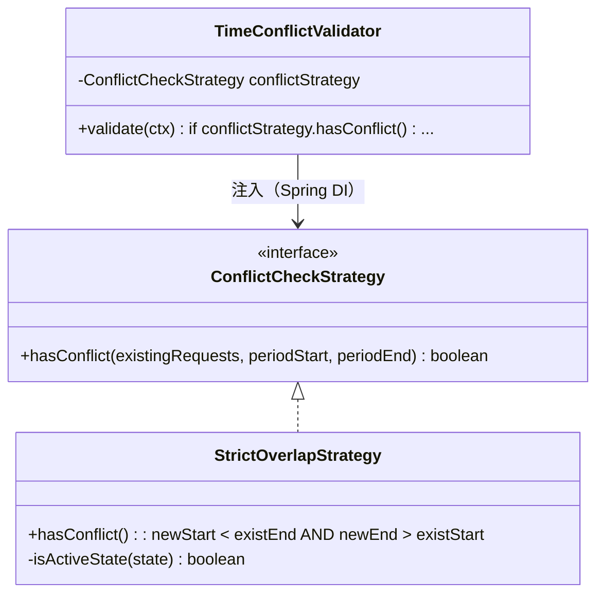

> Decorator Pattern（[#65](#8-decorator-pattern--可疊加的衝突緩衝策略65)）可在不修改 `StrictOverlapStrategy` 的情況下疊加「緩衝時間」規則。

---

### 4. Template Method Pattern — 服務層權限守衛

**問題**：`VehicleService`、`MaintenanceService`、`UserService` 每個 `public` 方法都以相同的 `if (!actor.can(permission)) throw new PermissionDeniedException(...)` 開頭，違反 DRY；未來需加入稽核日誌時，需修改每個 Service。

**解法**：`AbstractProtectedService` 定義「先驗證、後執行」的演算法骨架（Template Method），子類別以 lambda 提供業務邏輯。

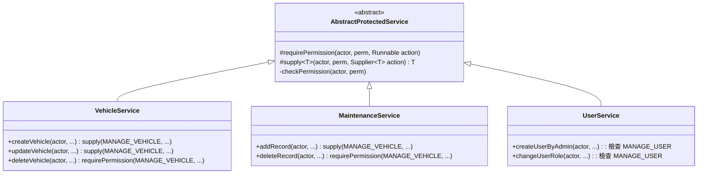

---

### 5. Factory Method Pattern — 角色建立

**問題**：`UserService` 需依字串（如 `"ADMIN"`）建立對應的 `Role` 物件，若直接 `new AdminRole()` 會產生對具體類別的直接依賴。

**解法**：`RoleFactory.create(roleName)` 集中管理 `Role` 物件建立，呼叫端只依賴 `Role` 介面（DIP）。新增角色只需加入新類別與一行 `case`，不需修改呼叫端（OCP）。

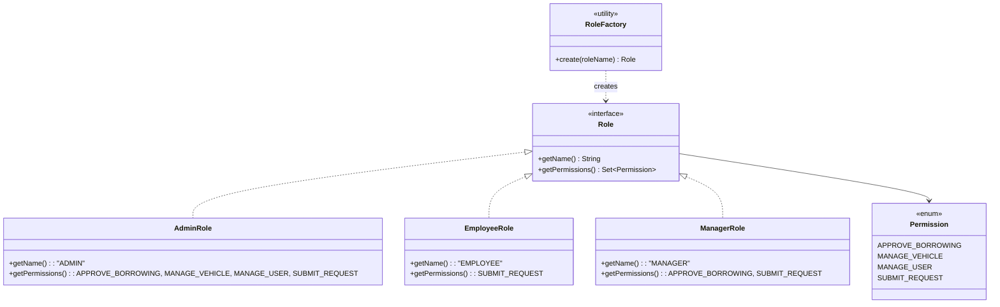

---

### 6. Adapter Pattern — Repository 橋接

**問題**：Domain 層定義了 `IVehicleRepository` 等領域介面，但資料持久化使用 Spring Data JPA，其介面（`JpaRepository`）與 Domain 介面不相容。

**解法**：每個 `*RepositoryAdapter` 類別實作 Domain 介面（Target），內部持有 JPA Repository（Adaptee），透過 `toDomain()` / `toEntity()` 轉換進行橋接（Object Adapter）。Service 層不感知 JPA 的存在（DIP）。

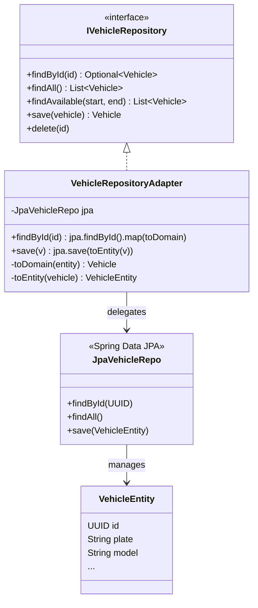

> 5 個 Adapter 結構相同：`BorrowingRepositoryAdapter`、`UserRepositoryAdapter`、`MaintenanceRepositoryAdapter`、`ViolationRepositoryAdapter`。

---

## OOD 原則應用

| 原則 | 應用位置 |
|------|----------|
| **SRP** | Service 層分為 BorrowingService / VehicleService / MaintenanceService / UserService，各自只有單一修改理由 |
| **OCP** | Factory Method 新增角色免改舊程式碼；Observer 新增通知管道免改 Service；Strategy 替換演算法免改 Context |
| **DIP** | 所有 Service 依賴 Repository 介面（非 JPA 實作）；Strategy 與 Observer 依賴抽象介面注入 |
| **LoD** | Service 呼叫 `request.approve()` 委派給 State，不直接操作狀態字串；`MaintenanceService` 呼叫 `record.isDue()` 而非讀取欄位 |
| **DRY** | `AbstractProtectedService` 統一權限守衛邏輯，消除各 Service 的重複 `if-throw` |
| **組合優於繼承** | `User` 持有 `Set<Role>`，`Role` 持有 `Set<Permission>`，角色以組合方式擴充 |

---

### 7. Builder Pattern — 借車申請物件建構（[#63](https://github.com/DamnDamnDamnM3/114-2_FCU_Framework-Design-Final/issues/63)）

**問題**：`BorrowingRepositoryAdapter.toDomain()` 從資料庫還原物件時，需呼叫 `r.approve(null); r.startUse();` 等副作用方法重播 State transition，會觸發 Observer 通知且邏輯脆弱。

**解法**：`BorrowingRequest.Builder` 提供 `restoreState(String)` 方法直接設定目標 State 物件，完全繞過 State transition 副作用，使 Adapter 的還原邏輯清晰且安全。

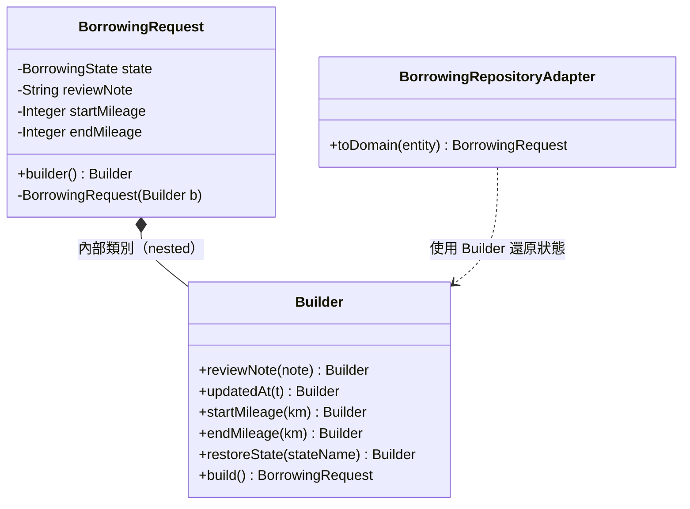

> `toDomain()` 舊寫法：`r.approve(null); r.startUse();`（重播副作用）
> 新寫法：`.restoreState("IN_USE").reviewNote(...).build()`（直接設定，無副作用）

---

### 8. Chain of Responsibility Pattern — 借車申請多步驟驗證（[#64](https://github.com/DamnDamnDamnM3/114-2_FCU_Framework-Design-Final/issues/64)）

**問題**：`BorrowingService.submitRequest()` 依序進行「權限檢查 → 車輛存在 → 時段衝突」三步驗證，邏輯全寫在一個方法中，新增驗證規則需修改 Service 本身（違反 OCP）。

**解法**：三個驗證步驟各自實作 `BorrowingValidator`（`@Component @Order`），Spring 依 `@Order` 排序後注入 `List<BorrowingValidator>`，`submitRequest()` 只需 `validators.forEach(v -> v.validate(ctx))`。

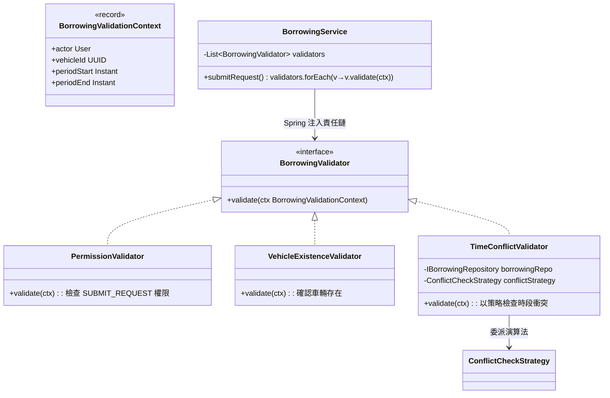

> 新增驗證規則（例如「同一員工每月申請不超過 5 次」）只需新增一個 `@Component @Order` 的 `BorrowingValidator` 實作，無需修改 `BorrowingService`（OCP）。

---

### 9. Decorator Pattern — 可疊加的衝突緩衝策略（[#65](https://github.com/DamnDamnDamnM3/114-2_FCU_Framework-Design-Final/issues/65)）

**問題**：若需在現有嚴格重疊策略上加入「借車前後保留 30 分鐘緩衝時間」的規則，直接修改 `StrictOverlapStrategy` 會使其邏輯複雜，且難以在不同情境下選擇是否啟用緩衝。

**解法**：`BufferedOverlapDecorator` 包裝任意 `ConflictCheckStrategy`，在委派前後延伸時段，不修改被包裝的策略（OCP）。透過 Spring `@Bean @Primary` 可選擇性啟用。

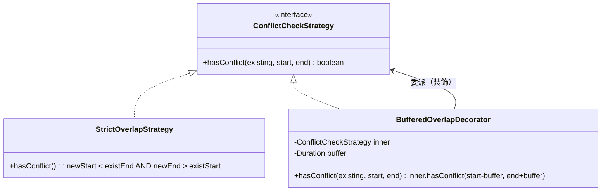

> 啟用緩衝：在 Spring 設定類別宣告 `@Bean @Primary ConflictCheckStrategy buffered(StrictOverlapStrategy base) { return new BufferedOverlapDecorator(base, Duration.ofMinutes(30)); }`

---

### 10. Command Pattern — 借車狀態操作稽核（[#66](https://github.com/DamnDamnDamnM3/114-2_FCU_Framework-Design-Final/issues/66)）

**問題**：`BorrowingController` 直接呼叫 `borrowingService.approveRequest(...)` 等方法，各操作的稽核日誌、非同步處理等橫切關注點分散在各 endpoint，無法統一管理。

**解法**：每個狀態變更操作封裝為 `BorrowingCommand`（`ApproveCommand`、`RejectCommand`、`StartUseCommand`、`CompleteCommand`），由 `BorrowingCommandBus`（Invoker）統一執行並記錄稽核日誌。

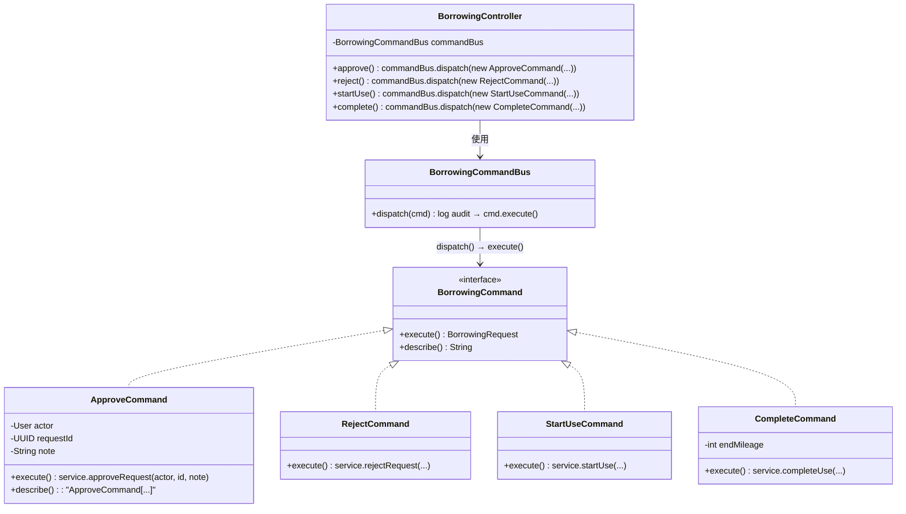

> `BorrowingCommandBus.dispatch()` 目前記錄 `[AUDIT]` 稽核日誌；未來可在此加入命令佇列、重試、非同步執行，無需修改任何 Command 實作（OCP）。

---

## UML 設計圖

### 狀態圖 — 借車申請生命週期（State Pattern）

> 同上方 [State Pattern](#1-state-pattern--借車申請生命週期) 章節的 `stateDiagram-v2`。

---

### 循序圖 — 借車工作流程（依生命週期階段拆分）

完整流程依借車申請的生命週期狀態 `PENDING → APPROVED → IN_USE → RETURNED` 拆分為四個階段，
各自聚焦一個 REST 端點與其涉及的設計模式，避免單一大圖資訊過載。

#### 階段 1：送出申請（Chain of Responsibility + State）

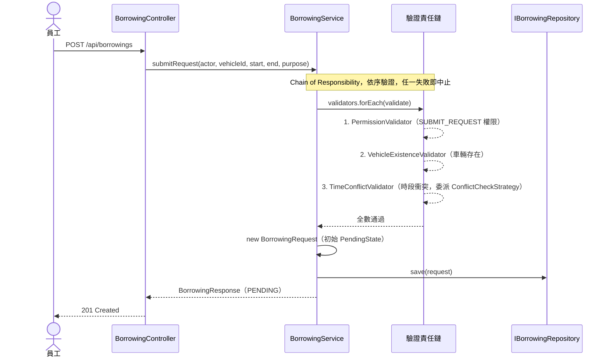

#### 階段 2：審核核准 / 拒絕（Command + State + Observer）

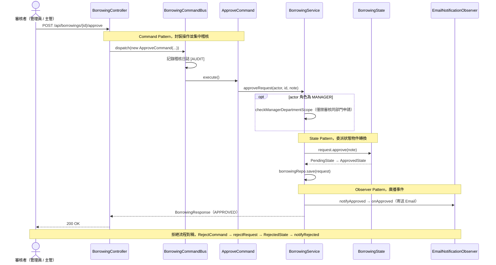

#### 階段 3：出車（Command + State + Observer）

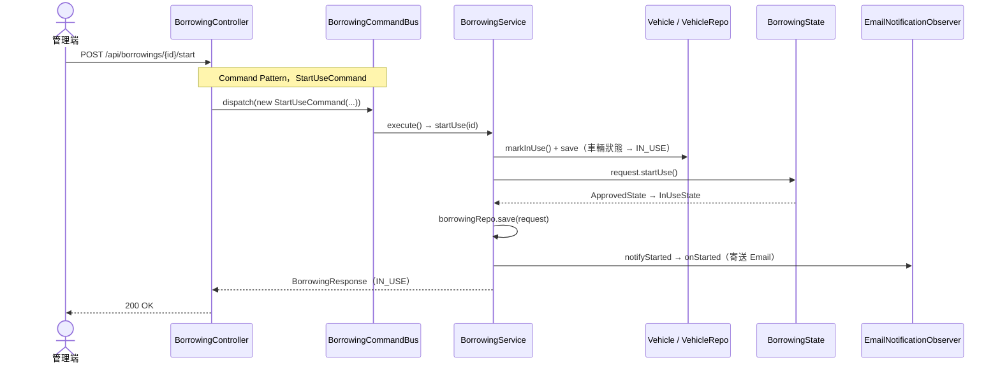

#### 階段 4：還車與違規偵測（Command + State + Observer + 自動違規）

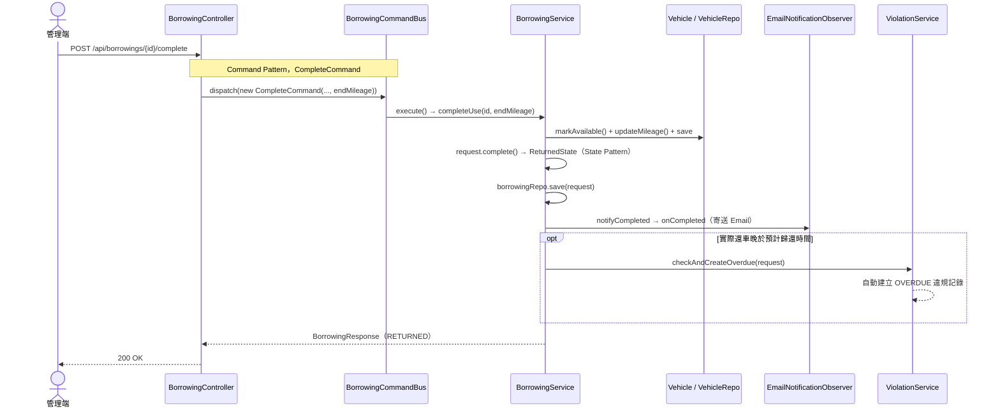

---

## 快速啟動

### 環境需求

- Java 21+（需加入 `PATH` 或設定 `JAVA_HOME`）
- Node.js 18+
- PostgreSQL 14+（**僅正式模式需要**，開發模式可跳過）
- Maven 3.9+（**可選**，本專案含 Maven Wrapper，無 Maven 亦可執行）

---

### 方式 A：開發模式（H2 記憶體資料庫，免安裝 PostgreSQL）

> 適合本機快速測試，啟動後自動建立測試帳號與車輛資料。

**後端（Windows PowerShell）**

```powershell
cd backend
.\mvnw.cmd spring-boot:run "-Dspring-boot.run.profiles=dev"
# API 服務啟動於 http://localhost:8080
```

**後端（Mac / Linux）**

```bash
cd backend
./mvnw spring-boot:run -Dspring-boot.run.profiles=dev
```

Dev 模式啟動後會自動建立：
- 管理員帳號：`admin@demo.com` / `Admin1234`
- 主管帳號：`manager@demo.com` / `Manager1234`（部門：測試部門）
- 員工帳號（員工甲）：`emp@demo.com` / `Emp12345`（部門：測試部門）
- 3 輛測試車輛

> 主管與員工甲同屬「測試部門」，可用於展示「主管僅能審核同部門員工借車申請」的部門範圍限制功能。

---

### 方式 B：正式模式（PostgreSQL）

**後端**

```powershell
# Windows PowerShell — 建立資料庫
createdb vehicle_mgmt

# 設定環境變數
$env:DB_USERNAME = "postgres"
$env:DB_PASSWORD = "your_password"
$env:JWT_SECRET  = "at-least-32-characters-long-secret"

# 啟動後端（Flyway 自動執行 DB 遷移）
cd backend
.\mvnw.cmd spring-boot:run
# API 服務啟動於 http://localhost:8080
```

```bash
# Mac / Linux
createdb vehicle_mgmt
export DB_USERNAME=postgres
export DB_PASSWORD=your_password
export JWT_SECRET=at-least-32-characters-long-secret

cd backend
./mvnw spring-boot:run
```

**手動建立測試帳號**

```powershell
# Windows PowerShell
Invoke-RestMethod -Method Post -Uri http://localhost:8080/api/auth/register `
  -ContentType "application/json" `
  -Body '{"name":"管理員","email":"admin@company.com","password":"Admin1234","role":"ADMIN"}'

Invoke-RestMethod -Method Post -Uri http://localhost:8080/api/auth/register `
  -ContentType "application/json" `
  -Body '{"name":"員工甲","email":"emp@company.com","password":"Emp12345","role":"EMPLOYEE"}'
```

```bash
# Mac / Linux（curl）
curl -X POST http://localhost:8080/api/auth/register \
  -H "Content-Type: application/json" \
  -d '{"name":"管理員","email":"admin@company.com","password":"Admin1234","role":"ADMIN"}'

curl -X POST http://localhost:8080/api/auth/register \
  -H "Content-Type: application/json" \
  -d '{"name":"員工甲","email":"emp@company.com","password":"Emp12345","role":"EMPLOYEE"}'
```

---

### 前端

```bash
cd frontend
npm install
npm run dev
# 前端啟動於 http://localhost:5173
```

---

## API 文件

所有需要認證的端點請在 Header 加入：  
`Authorization: Bearer <JWT Token>`

### 認證

| 方法 | 路徑 | 說明 |
|------|------|------|
| POST | `/api/auth/register` | 註冊帳號（body: `name, email, password, role`） |
| POST | `/api/auth/login` | 登入，回傳 JWT token |

### 車輛管理

| 方法 | 路徑 | 權限 | 說明 |
|------|------|------|------|
| GET | `/api/vehicles` | 認證用戶 | 所有車輛列表 |
| GET | `/api/vehicles/available?start=&end=` | 認證用戶 | 查詢時段內可用車輛 |
| GET | `/api/vehicles/{id}` | 認證用戶 | 取得單一車輛 |
| POST | `/api/vehicles` | Admin | 新增車輛 |
| PUT | `/api/vehicles/{id}` | Admin | 更新車輛 |
| DELETE | `/api/vehicles/{id}` | Admin | 刪除車輛 |

### 借車申請

| 方法 | 路徑 | 權限 | 說明 |
|------|------|------|------|
| POST | `/api/borrowings` | 認證用戶 | 送出借車申請 |
| GET | `/api/borrowings/my` | 認證用戶 | 查看個人申請記錄 |
| GET | `/api/borrowings/pending` | 認證用戶 | 待審核申請列表 |
| GET | `/api/borrowings` | Admin | 所有申請記錄 |
| POST | `/api/borrowings/{id}/approve` | Admin | 核准申請 |
| POST | `/api/borrowings/{id}/reject` | Admin | 拒絕申請 |
| POST | `/api/borrowings/{id}/start` | Admin | 標記出車 |
| POST | `/api/borrowings/{id}/complete` | Admin | 標記還車 |

### 保養管理

| 方法 | 路徑 | 權限 | 說明 |
|------|------|------|------|
| POST | `/api/maintenance` | Admin | 新增保養記錄 |
| GET | `/api/maintenance/vehicle/{vehicleId}` | 認證用戶 | 查詢車輛保養記錄 |
| DELETE | `/api/maintenance/{id}` | Admin | 刪除保養記錄 |

### 使用者管理

| 方法 | 路徑 | 權限 | 說明 |
|------|------|------|------|
| GET | `/api/users` | Admin | 查詢所有使用者 |
| GET | `/api/users/{id}` | Admin | 查詢單一使用者 |
| POST | `/api/users` | Admin | 建立使用者（body: `name, email, password, role`） |
| PUT | `/api/users/{id}` | Admin | 更新名稱與 Email |
| PATCH | `/api/users/{id}/role` | Admin | 變更使用者角色（body: `role`） |
| DELETE | `/api/users/{id}` | Admin | 刪除使用者帳號 |

---

## 測試

### 單元測試

使用 InMemory Repository 實作，不依賴資料庫，執行速度為毫秒級：

```powershell
# Windows PowerShell
cd backend
.\mvnw.cmd test "-Dtest=*ServiceTest"
```

```bash
# Mac / Linux
cd backend
./mvnw test -Dtest="*ServiceTest"
```

| 測試類別 | 測試案例 |
|----------|----------|
| `BorrowingServiceTest` | 送審、核准、拒絕、員工無法審核、衝突檢查、完整工作流程 |
| `VehicleServiceTest` | 建立、查詢、刪除、員工無法管理車輛 |
| `MaintenanceServiceTest` | 新增、查詢（依車輛）、到期提醒、刪除、員工無法操作 |
| `UserServiceTest` | 註冊、密碼雜湊、重複 email、角色權限驗證 |

### 整合測試（HTTP 層）

使用 `@WebMvcTest` + `@MockBean` 測試 REST 控制器的完整 HTTP 處理鏈：

```powershell
# Windows PowerShell
.\mvnw.cmd test "-Dtest=BorrowingControllerTest"
```

```bash
# Mac / Linux
./mvnw test -Dtest="BorrowingControllerTest"
```

測試內容涵蓋：HTTP 狀態碼、JSON 序列化、JWT 認證守衛、权限拒絕（403）、未認證請求（401）。

---

## 資料庫 ERD

```
users ─────────────────────────────────────────────────────────
  id, name, email, password_hash, created_at
  │
  ├──→ user_roles ──→ roles ──→ role_permissions ──→ permissions
  │
  └──→ borrowing_requests ──→ vehicles
         id, user_id, vehicle_id                   id, plate, model, year, status
         period_start, period_end                  created_at
         state, review_note
         created_at, updated_at
                                  vehicles ──→ maintenance_records
                                                id, vehicle_id, date
                                                items, cost
                                                next_due_date, next_due_km
```

---

## 開發里程碑

| Phase | 內容 | Issues |
|-------|------|--------|
| Phase 1 | 初始化後端（Spring Boot）、前端（Vue 3）、DB 遷移結構 | #1–3 ✅ |
| Phase 2 | Domain Layer — Vehicle、User、BorrowingRequest（State Pattern）、Role（Factory） | #4–7 ✅ |
| Phase 3 | Repository Layer — 介面定義、InMemory 實作、JPA Adapter | #8–10 ✅ |
| Phase 4 | Service Layer — BorrowingService（Observer + Strategy）、VehicleService 等 | #11–13 ✅ |
| Phase 5 | Presentation Layer — REST Controllers、DTOs、JWT Security | #14–17 ✅ |
| Phase 6 | Frontend — 5 個 Vue 3 頁面（登入、借車、審核、車輛管理、保養管理） | #18–22 ✅ |
| Phase 7 | 測試 — 4 個 Service 單元測試、1 個 Controller 整合測試 | #23–24 ✅ |
| Phase 8 | 使用者帳號管理 — CRUD API、前端管理頁面、角色切換 | #35 ✅ |
| Phase 9 | UML 文件（Mermaid）與 JavaDoc 全面補全 | #36 ✅ |
| Phase 10 | 新功能擴充 — 里程追蹤、月曆視圖、衝突 UI、違規記錄、儀表板、Excel 匯出、MANAGER 角色 | #52–58 ✅ |
| Phase 11 | CI/CD — GitHub Actions tag-based 自動部署至 VPS | #59 ✅ |

---

## CI/CD 自動部署

### 架構概覽

```
push tag v*
    │
    ▼
GitHub Actions
    ├─ 建置後端 JAR（Maven, Java 21）
    ├─ SCP 上傳 JAR 到 VPS ~/deploy/
    └─ SSH 進 VPS
         ├─ git pull 最新前端原始碼
         ├─ npm install 前端相依套件
         ├─ pm2 重啟後端（port 8080，dev profile，H2 DB）
         └─ pm2 重啟前端（port 5173，Vite dev server）
                  │
                  ▼
         Cloudflare Tunnel
         demo.jw-albert.dev → localhost:5173
         /api/* → proxied to localhost:8080
```

### 觸發條件

CI/CD **只在推送 `v*` 格式的 tag 時觸發**，不監聽 push to main。  
這樣可以精準控制部署時機，節省 GitHub Actions 額度。

```bash
# 完成所有 PR 合併後，在 main 分支推送 tag 即可觸發部署
git checkout main
git pull origin main
git tag v1.0.0
git push origin v1.0.0
```

Tag 命名建議遵循 [Semantic Versioning](https://semver.org/)：
- `v1.0.0` — 正式版本
- `v1.1.0` — 新增功能
- `v1.0.1` — 修復 Bug

### GitHub Secrets 設定

| Secret 名稱 | 說明 |
|-------------|------|
| `HOST_ADDRESS` | VPS IP 或域名 |
| `HOST_PORT` | SSH Port |
| `ACCOUNT_NAME` | SSH 使用者名稱 |
| `ACCOUNT_PASSWORD` | SSH 密碼 |

### VPS 環境需求

| 項目 | 說明 |
|------|------|
| Java 21 | 需安裝並可被 `which java` 找到（或位於 `/usr/bin/java`） |
| Node.js 18+ | 執行 Vite dev server |
| PM2 | 首次部署時會自動安裝（無需 sudo） |
| Git | 用於 clone / pull 前端原始碼 |
| Cloudflare Tunnel | 已設定 `demo.jw-albert.dev → localhost:5173` |

> **注意**：VPS 使用者不需要 sudo 權限。PM2 透過 `NPM_CONFIG_PREFIX=$HOME/.npm-global` 安裝於使用者目錄下。

### 本地手動部署（不透過 CI）

```bash
# SSH 進 VPS 後手動操作
export NPM_CONFIG_PREFIX="$HOME/.npm-global"
export PATH="$HOME/.npm-global/bin:$PATH"

# 更新程式碼
git -C ~/repo pull origin main
cd ~/repo/frontend && npm install

# 重啟服務
JAVA_BIN=$(which java)
pm2 delete vehicle-backend 2>/dev/null || true
pm2 start "$JAVA_BIN -jar ~/app/app.jar --spring.profiles.active=dev" --name vehicle-backend
pm2 delete vehicle-frontend 2>/dev/null || true
pm2 start "npm run dev" --name vehicle-frontend --cwd ~/repo/frontend
pm2 save && pm2 list
```
