# 公司車輛管理系統 — 專案書面報告

> 114-2 逢甲大學 軟體框架設計 期末專題
> 程式碼倉庫（Repository）：<https://github.com/DamnDamnDamnM3/114-2_FCU_Framework-Design-Final>
> 線上展示：<https://demo.jw-albert.dev>（測試帳號：`admin@demo.com / Admin1234`、`emp@demo.com / Emp12345`）

---

## 一、組員資料與分工

| 學號 | 姓名 | 主要負責 |
|------|------|----------|
| D1210799 | 王建葦 | 系統架構設計、OOD 原則應用、後端 API 與設計模式實作 |
| D1249623 | 陳稚翔 | 前端 Vue 3 實作、資料庫設計、整合測試 |

- 版本控管：採 GitHub Flow，分支命名 `feature/<kebab-case>` 與 `fix/<kebab-case>`，commit 遵循 Conventional Commits（`feat:` / `fix:`，並以 `closes #issue` 串接議題）。
- 部署：推送 `v*` tag 觸發 GitHub Actions CI/CD，自動建置 JAR 並 SSH 部署至 VPS。

---

## 二、專案概覽

本系統為**企業內部車輛借用管理平台**，涵蓋「借車申請 → 審核 → 出車 → 還車」完整工作流程，並延伸出企業化功能：站內通知收件夾、稽核日誌、帳號安全（密碼政策 + 登入鎖定）、違規記錄、車輛軟刪除與報表匯出。

專案的核心目標是以一個真實可運作的系統，展示**物件導向設計（OOD）原則**（SOLID、迪米特法則 LoD）與 **10 個 GoF 設計模式**的實際應用，而非僅作教科書範例。

**規模統計：**

| 項目 | 數量 |
|------|------|
| 後端 Java 檔案 | 130 |
| 前端 Vue / TS 檔案 | 27 |
| Flyway 資料庫遷移 | 8（V1 ～ V8） |
| GoF 設計模式 | 10 |
| 角色 | 3（ADMIN / MANAGER / EMPLOYEE） |

---

## 三、技術棧

**後端**
- Java 21、Spring Boot 3.3.4
- Spring Security + JJWT 0.12.6（JWT 驗證）、Spring Data JPA、Flyway（DB 遷移）
- Apache POI 5.3.0（Excel 匯出）、springdoc-openapi 2.6.0（Swagger UI）、Spring Boot Actuator（健康監控）
- H2（dev profile）、PostgreSQL（prod profile）
- Maven 3.9+（含 Maven Wrapper）

**前端**
- TypeScript 5.5、Vue 3.5 + Vite 5.4
- Pinia 2.2（狀態管理）、Vue Router 4.4（路由守衛）、Axios 1.7、Chart.js 4.5（報表圖表）

---

## 四、系統架構（分層）

專案採**領域導向分層架構**，依賴方向一律由外往內（Controller → Service → Domain ← Infrastructure），核心領域不依賴任何框架：

| 層（由外而內） | 內容 | 框架角色 |
|----------------|------|----------|
| `api/controller` | REST 入口（Borrowing、Vehicle…） | Spring MVC、JWT 驗證 |
| `service` | 業務邏輯（BorrowingService…） | 套用設計模式的主場 |
| `domain` | 純領域模型（不依賴 Spring）：`model` / `state` / `role` / `observer` / `strategy` / `chain` / `command` | 核心，零框架依賴 |
| `repository` | 介面（IBorrowingRepository…） | DIP 邊界 |
| `infrastructure` | JPA Adapter / JWT / Flyway | 框架實作細節 |

依賴方向（外層依賴內層，`infrastructure` 透過 `repository` 介面反轉依賴回 `domain`）：

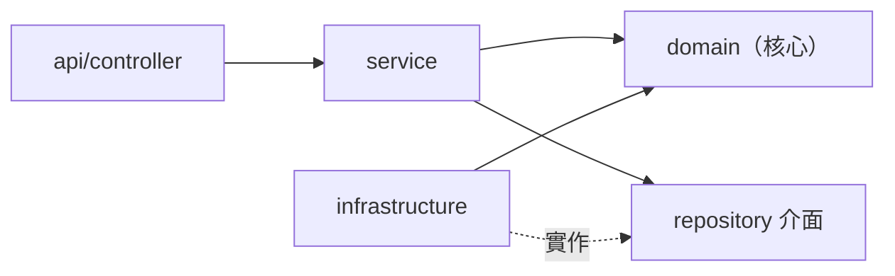

**關鍵設計決策**：`domain/` 套件下的類別（如 `BorrowingRequest`、`BorrowingState`、`User`）**完全不含 Spring 註解**，是純 POJO 領域物件。框架的痕跡（`@Service`、`@Repository`、JPA Entity）只出現在 `service/` 與 `infrastructure/`。這讓核心業務規則可獨立於框架測試與演進。

對應的目錄：[backend/src/main/java/com/vehicle/management/](backend/src/main/java/com/vehicle/management/)

---

## 五、核心工作流程：借車申請生命週期

一筆借車申請（`BorrowingRequest`）的狀態流轉如下：

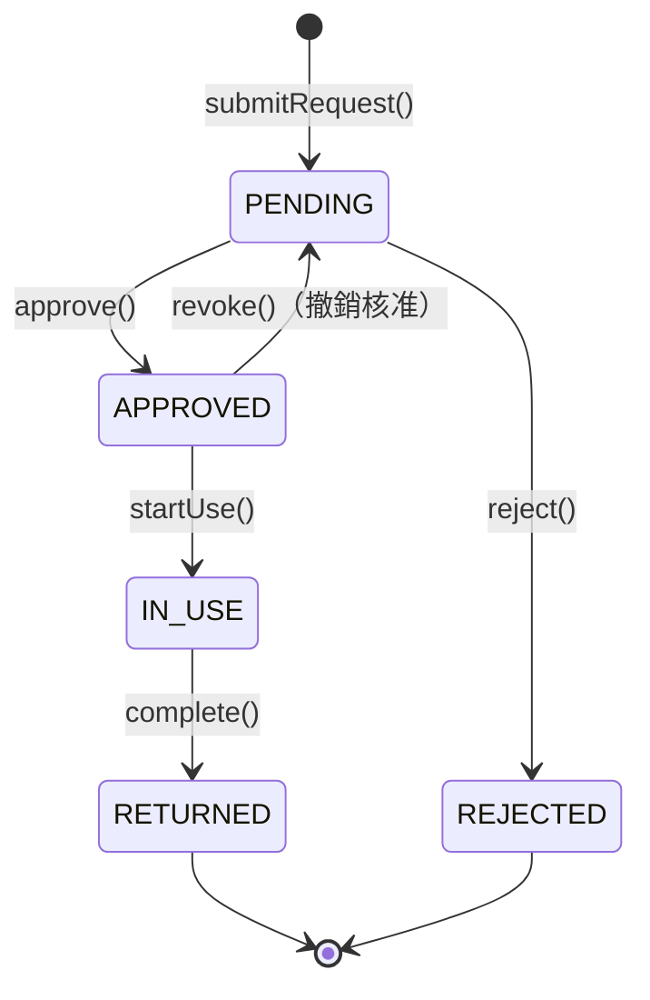

以「送出申請」為例，串接了多個設計模式，可看出各模式如何協作（[BorrowingService.java:89](backend/src/main/java/com/vehicle/management/service/BorrowingService.java#L89)）：

```java
public BorrowingRequest submitRequest(User actor, UUID vehicleId,
                                      Instant start, Instant end, String purpose) {
    // ① Chain of Responsibility：依序跑權限 → 車輛存在 → 時段衝突三道驗證
    BorrowingValidationContext ctx = new BorrowingValidationContext(actor, vehicleId, start, end);
    validators.forEach(v -> v.validate(ctx));

    // ② 建立領域物件，初始狀態為 PendingState（State Pattern）
    BorrowingRequest request = new BorrowingRequest(
            UUID.randomUUID(), actor.getId(), vehicleId, start, end, purpose, Instant.now());
    BorrowingRequest saved = borrowingRepo.save(request);   // ③ 透過 Adapter 落地

    // ④ Observer Pattern：廣播事件，寫入審核者收件夾、寄送 Email
    notifySubmitted(saved);
    return saved;
}
```

審核動作（核准 / 拒絕 / 出車 / 還車）則統一經由 **Command Bus** 派發，集中記錄稽核日誌（見下方 Command Pattern）。

---

## 六、設計模式詳解（10 個 GoF）

下表為 10 個模式的全貌，後續逐一以程式碼講解。

| # | 模式 | 分類 | 核心類別 |
|---|------|------|----------|
| 1 | State | Behavioral | `BorrowingRequest`, `BorrowingState`, `PendingState`… |
| 2 | Observer | Behavioral | `BorrowingEventPublisher`, `Inbox/EmailNotificationObserver` |
| 3 | Strategy | Behavioral | `ConflictCheckStrategy`, `StrictOverlapStrategy` |
| 4 | Template Method | Behavioral | `AbstractProtectedService` |
| 5 | Factory Method | Creational | `RoleFactory`, `AdminRole`, `EmployeeRole`, `ManagerRole` |
| 6 | Adapter | Structural | `*RepositoryAdapter` + `Jpa*Repo` |
| 7 | Builder | Creational | `BorrowingRequest.Builder` |
| 8 | Chain of Responsibility | Behavioral | `BorrowingValidator` 責任鏈 |
| 9 | Decorator | Structural | `BufferedOverlapDecorator` |
| 10 | Command | Behavioral | `BorrowingCommand`, `BorrowingCommandBus` |

---

### 1. State Pattern — 借車申請生命週期

**問題**：申請有 5 種狀態，各狀態允許的操作不同。若在 `BorrowingRequest` 內用 `if/switch` 判斷狀態，新增狀態就要改一大片。

**解法**：把每個狀態封裝成獨立類別，`BorrowingRequest`（Context）持有一個 `BorrowingState` 介面，所有操作委派給目前狀態物件決定是否合法。

`BorrowingRequest` 自身**沒有任何狀態判斷分支**，只是轉發（[BorrowingRequest.java:156](backend/src/main/java/com/vehicle/management/domain/model/BorrowingRequest.java#L156)）：

```java
public void approve(String reviewNote) {
    state.approve(this, reviewNote);   // 委派給目前狀態，不問「現在是什麼狀態」
    this.updatedAt = Instant.now();
}
```

合法轉換寫在各 ConcreteState。`PendingState` 允許核准 / 拒絕，其餘操作直接拋例外（[PendingState.java:21](backend/src/main/java/com/vehicle/management/domain/state/PendingState.java#L21)）：

```java
public class PendingState implements BorrowingState {
    @Override public void approve(BorrowingRequest r, String note) {
        r.transitionState(new ApprovedState(), note);   // PENDING → APPROVED
    }
    @Override public void reject(BorrowingRequest r, String note) {
        r.transitionState(new RejectedState(), note);    // PENDING → REJECTED
    }
    @Override public void startUse(BorrowingRequest r) {
        throw new InvalidStateTransitionException(getStateName(), "startUse");  // 不合法
    }
    // …
}
```

非法轉換（如對已還車的申請再核准）拋出 `InvalidStateTransitionException`，由 `GlobalExceptionHandler` 轉成 HTTP 422。

> **遵守的原則**：OCP（新增狀態只需新增一個實作類別）、LoD（Service 層只呼叫 `request.approve()`，不碰狀態字串）。


**UML（取自 README）：**

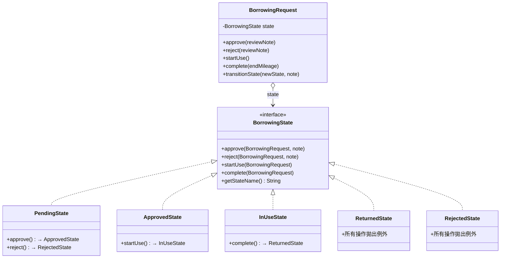

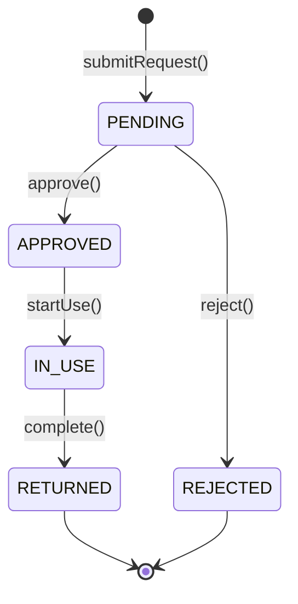

---

### 2. Observer Pattern — 借車事件通知

**問題**：申請狀態變化時要通知多方（站內收件夾、Email…），未來還可能加 SMS / Line。若 Service 直接呼叫各通知類別，每加一種管道就要改 Service。

**解法**：`BorrowingService` 繼承 `BorrowingEventPublisher`（Subject），Spring 啟動時**自動注入所有 `BorrowingEventObserver` Bean**，Service 只呼叫 `notifyApproved()` 等廣播方法。

訂閱者由建構子自動收集（[BorrowingService.java:59](backend/src/main/java/com/vehicle/management/service/BorrowingService.java#L59)）：

```java
public BorrowingService(…, List<BorrowingEventObserver> observers, …) {
    observers.forEach(this::addObserver);   // Spring 把所有 @Component observer 都丟進來
}
```

廣播時不感知具體實作（[BorrowingEventPublisher.java:59](backend/src/main/java/com/vehicle/management/domain/observer/BorrowingEventPublisher.java#L59)）：

```java
protected void notifyApproved(BorrowingRequest request) {
    observers.forEach(o -> o.onApproved(request));
}
```

具體觀察者 `InboxNotificationObserver` 把核准事件寫入申請人收件夾；送出事件則只通知「可審核者」（所有 ADMIN + 同部門 MANAGER）（[InboxNotificationObserver.java:34](backend/src/main/java/com/vehicle/management/domain/observer/InboxNotificationObserver.java#L34)）。

> **擴展性實證**：新增 SMS 通知只需寫一個 `implements BorrowingEventObserver` 並標 `@Component`，**完全不動 Service**（OCP + DIP）。


**UML（取自 README）：**

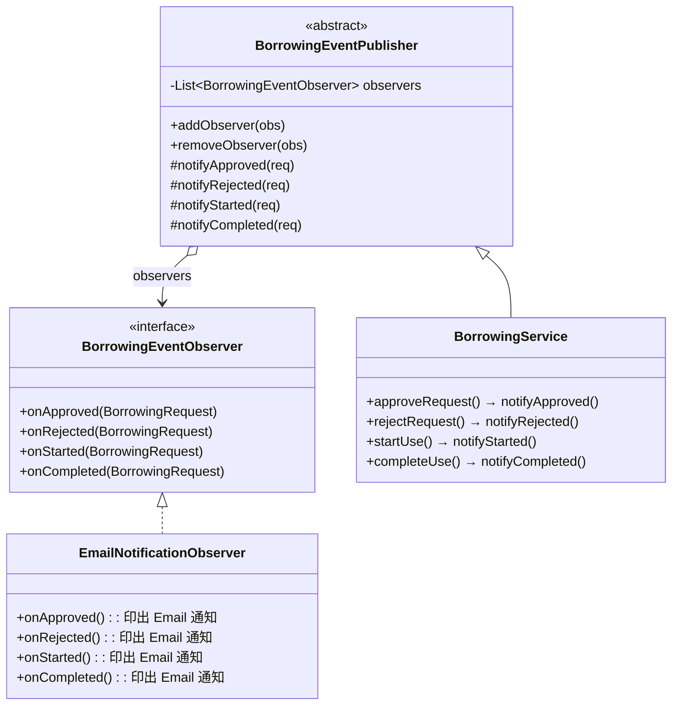

---

### 3. Strategy Pattern — 時段衝突檢查

**問題**：「時段是否衝突」的判斷規則可能改變（嚴格重疊、含緩衝、寬鬆…）。

**解法**：`ConflictCheckStrategy` 介面定義演算法，`StrictOverlapStrategy` 為預設實作，透過 Spring DI 注入，替換策略只需換 Bean。

判斷公式為半開區間重疊（[StrictOverlapStrategy.java:28](backend/src/main/java/com/vehicle/management/domain/strategy/StrictOverlapStrategy.java#L28)）：

```java
return existingRequests.stream()
        .filter(r -> isActiveState(r.getStateName()))           // 只看 PENDING/APPROVED/IN_USE
        .anyMatch(r -> periodStart.isBefore(r.getPeriodEnd())   // newStart < existingEnd
                    && periodEnd.isAfter(r.getPeriodStart()));  // newEnd   > existingStart
```

策略被 `TimeConflictValidator`（責任鏈節點）注入使用，可見模式間的組合。


**UML（取自 README）：**

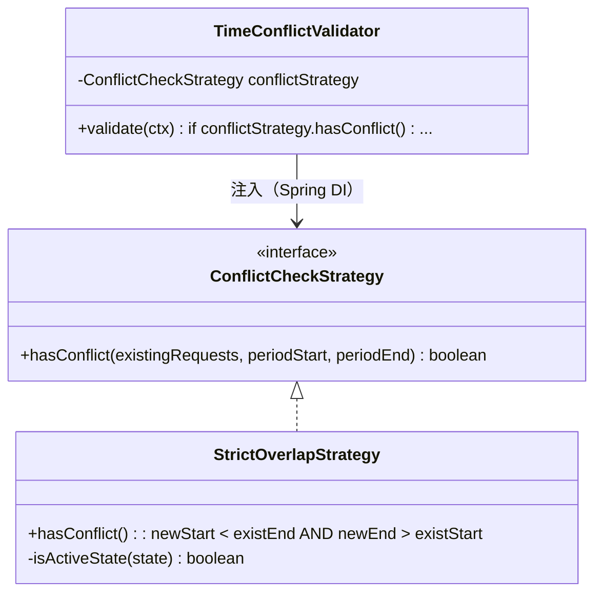

---

### 4. Template Method Pattern — 服務層權限守衛

**問題**：`VehicleService`、`UserService`、`MaintenanceService` 都要先「驗證權限再執行」，這段 if-throw 重複出現。

**解法**：抽出 `AbstractProtectedService`，定義「先驗證、後執行」的演算法骨架，子類別以 lambda 提供業務邏輯（[AbstractProtectedService.java:44](backend/src/main/java/com/vehicle/management/service/AbstractProtectedService.java#L44)）：

```java
protected <T> T supply(User actor, Permission permission, Supplier<T> action) {
    checkPermission(actor, permission);   // 骨架固定步驟：授權檢查
    return action.get();                  // 變動步驟：交給子類別的 lambda
}
private void checkPermission(User actor, Permission permission) {
    if (!actor.can(permission)) {
        throw new PermissionDeniedException(actor.getEmail() + " lacks permission: " + permission.name());
    }
}
```

> 未來要加稽核、速率限制等橫切關注點，只改這一處，所有子服務自動受惠（DRY + OCP）。


**UML（取自 README）：**

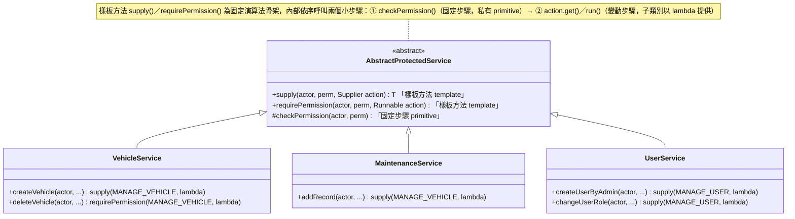

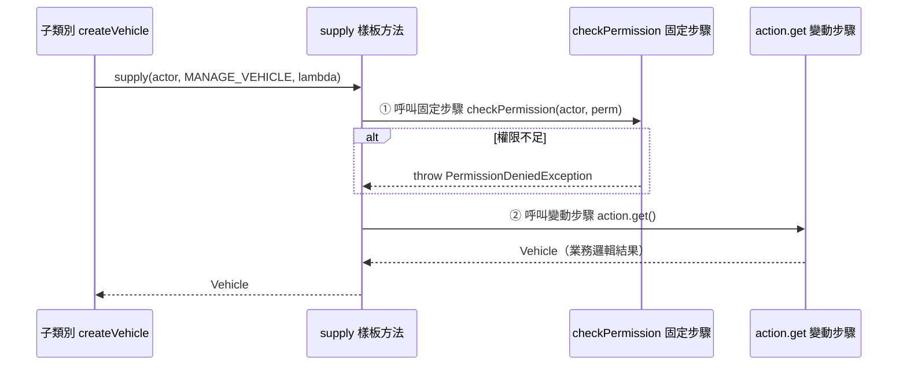

---

### 5. Factory Method Pattern — 角色建立

**問題**：到處 `new AdminRole()` / `new EmployeeRole()` 會讓呼叫端依賴具體類別。

**解法**：`RoleFactory.create(roleName)` 集中建立邏輯，回傳 `Role` 介面（[RoleFactory.java:30](backend/src/main/java/com/vehicle/management/domain/role/RoleFactory.java#L30)）：

```java
public static Role create(String roleName) {
    return switch (roleName.toUpperCase()) {
        case "ADMIN"    -> new AdminRole();
        case "EMPLOYEE" -> new EmployeeRole();
        case "MANAGER"  -> new ManagerRole();
        default -> throw new IllegalArgumentException("Unknown role: " + roleName);
    };
}
```

角色與權限的關係由 `Permission` 列舉 + 各 `Role` 實作組合，`User.can()` 透過多型判斷能力（[User.java:81](backend/src/main/java/com/vehicle/management/domain/model/User.java#L81)）：

```java
public boolean can(Permission permission) {
    return roles.stream()
            .flatMap(role -> role.getPermissions().stream())
            .anyMatch(p -> p == permission);   // 不感知具體角色，純多型
}
```


**UML（取自 README）：**

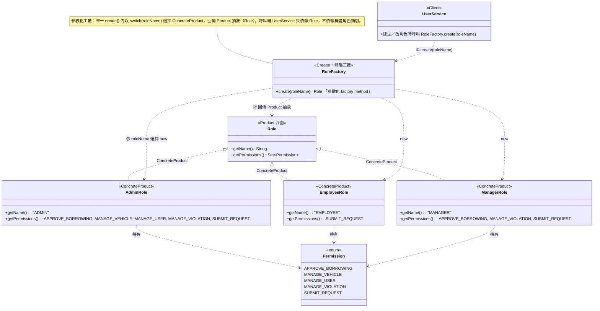

---

### 6. Adapter Pattern — Repository 橋接

**問題**：Service 層只想依賴乾淨的 Domain 介面，不想知道 JPA 的存在；但 JPA 回傳的是 Entity，不是 Domain 物件。

**解法**：每個 `*RepositoryAdapter` 實作 Domain 介面（Target），內部持有 JPA Repository（Adaptee），用 `toDomain()` / `toEntity()` 轉換（Object Adapter）（[BorrowingRepositoryAdapter.java:55](backend/src/main/java/com/vehicle/management/infrastructure/persistence/BorrowingRepositoryAdapter.java#L55)）：

```java
@Override public BorrowingRequest save(BorrowingRequest request) {
    return toDomain(jpa.save(toEntity(request)));   // Domain ↔ Entity 雙向轉換
}
```

`toDomain()` 還結合了 Builder Pattern 還原狀態（見下一節）。Service 層全程只看到 `IBorrowingRepository`，達成 DIP。系統共有 5 個結構相同的 Adapter。


**UML（取自 README）：**

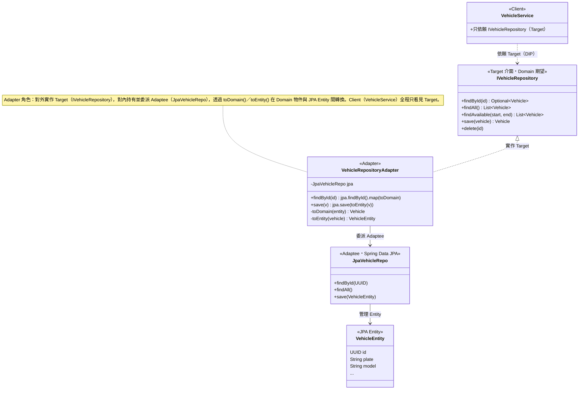

---

### 7. Builder Pattern — 借車申請物件還原

**問題**：從 DB 還原 `BorrowingRequest` 時，狀態應直接設為 `APPROVED`，但若呼叫 `approve()` 會觸發轉換副作用（重播事件、改備註）。一般建構子又無法直接塞入「任意狀態」。

**解法**：`BorrowingRequest.Builder` 提供 `restoreState(stateName)`，直接設定目標狀態而不重播轉換（[BorrowingRequest.java:134](backend/src/main/java/com/vehicle/management/domain/model/BorrowingRequest.java#L134)）：

```java
public Builder restoreState(String stateName) {
    this.state = switch (stateName != null ? stateName : "PENDING") {
        case "APPROVED" -> new ApprovedState();
        case "IN_USE"   -> new InUseState();
        case "RETURNED" -> new ReturnedState();
        case "REJECTED" -> new RejectedState();
        default         -> new PendingState();
    };
    return this;
}
```

Adapter 還原時就用它，乾淨且無副作用：

```java
return BorrowingRequest.builder(e.getId(), e.getUserId(), …)
        .restoreState(e.getState())
        .reviewNote(e.getReviewNote())
        .startMileage(e.getStartMileage())
        .build();
```

> **設計亮點**：Builder 與 State 兩個模式在持久化邊界上互補——State 管「執行期的合法轉換」，Builder 管「還原期的直接設定」。


**UML（取自 README）：**

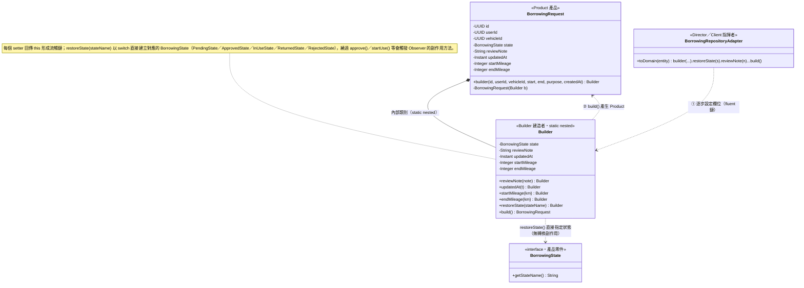

---

### 8. Chain of Responsibility — 借車申請多步驟驗證

**問題**：送出申請前要連續做多項檢查（權限、車輛存在、時段衝突），把它們塞進一個方法會越長越亂。

**解法**：每個檢查是一個 `BorrowingValidator`，由 Spring 依 `@Order` 排序組成責任鏈，任一節點失敗即丟例外中斷（[TimeConflictValidator.java:30](backend/src/main/java/com/vehicle/management/domain/chain/TimeConflictValidator.java#L30)）：

```java
@Component @Order(3)
public class TimeConflictValidator implements BorrowingValidator {
    @Override public void validate(BorrowingValidationContext ctx) {
        var conflicts = borrowingRepo.findConflicting(ctx.vehicleId(), ctx.periodStart(), ctx.periodEnd());
        if (conflictStrategy.hasConflict(conflicts, ctx.periodStart(), ctx.periodEnd())) {
            throw new ConflictException("Vehicle is already booked for this period");
        }
    }
}
```

鏈順序：`PermissionValidator`（@Order 1）→ `VehicleExistenceValidator`（2）→ `TimeConflictValidator`（3）。Service 只需 `validators.forEach(v -> v.validate(ctx))`，新增規則只要加一個 `@Component` + `@Order`，不改 Service（OCP）。

> 此處也展示模式組合：第 3 節點內部注入 Strategy，驗證順序由鏈控制、衝突演算法可替換。


**UML（取自 README）：**

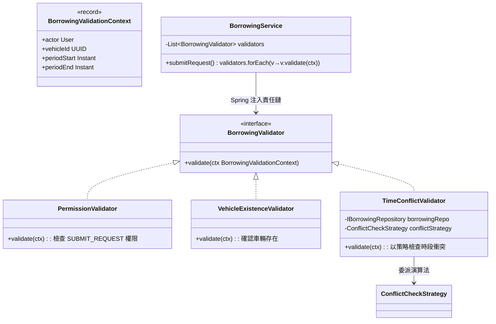

---

### 9. Decorator Pattern — 可疊加的衝突緩衝策略

**問題**：想在既有衝突檢查上加「申請之間保留 30 分鐘緩衝」，但不想改 `StrictOverlapStrategy`（會影響其他使用者）。

**解法**：`BufferedOverlapDecorator` 包裝任意 `ConflictCheckStrategy`，檢查前先把新時段前後各延伸 buffer 再委派內層（[BufferedOverlapDecorator.java:44](backend/src/main/java/com/vehicle/management/domain/strategy/BufferedOverlapDecorator.java#L44)）：

```java
@Override public boolean hasConflict(List<BorrowingRequest> existing, Instant start, Instant end) {
    return inner.hasConflict(existing,
            start.minus(buffer),   // 前後各加緩衝
            end.plus(buffer));
}
```

因實作同一介面，可動態疊加多層，不影響其他元件（OCP）。啟用方式為宣告 `@Bean @Primary` 包住 `StrictOverlapStrategy`。

> **Decorator vs Strategy**：兩者都實作 `ConflictCheckStrategy`，但 Strategy 是「替換」演算法，Decorator 是「在不改原演算法下加料」。


**UML（取自 README）：**

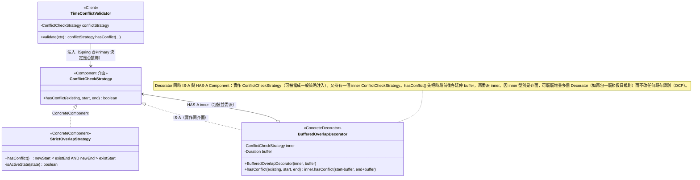

---

### 10. Command Pattern — 借車狀態操作稽核

**問題**：核准 / 拒絕 / 出車 / 還車 / 撤銷都是狀態變更操作，都需要稽核記錄。若稽核散落在各 Controller / Service，難以統一。

**解法**：每個操作封裝成 `BorrowingCommand`（ConcreteCommand），由 `BorrowingCommandBus`（Invoker）統一派發並集中記錄稽核（[BorrowingCommandBus.java:33](backend/src/main/java/com/vehicle/management/service/BorrowingCommandBus.java#L33)）：

```java
public BorrowingRequest dispatch(BorrowingCommand command) {
    BorrowingRequest result = command.execute();
    String action = command.getClass().getSimpleName();
    log.info("[AUDIT] {} → id={}", command.describe(), result.getId());
    auditService.record(action, command.describe(), result.getId());   // 持久化稽核
    return result;
}
```

Controller 只負責組裝命令並丟給 Bus（[BorrowingController.java:96](backend/src/main/java/com/vehicle/management/api/controller/BorrowingController.java#L96)）：

```java
return BorrowingResponse.from(
    commandBus.dispatch(new ApproveCommand(borrowingService, actor, id, note)));
```

> 稽核邏輯只在 Bus 一處，未來要加命令排隊、回滾、非同步，皆不必改各 Command（OCP）。


**UML（取自 README）：**

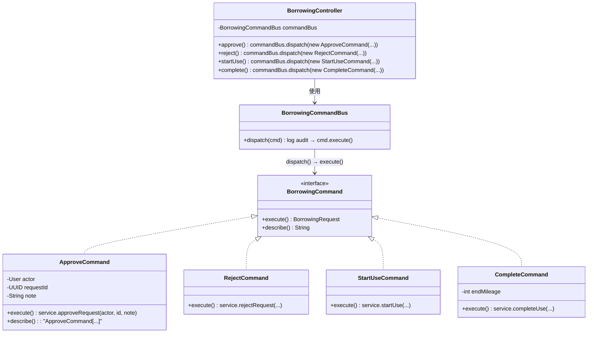

---

## 七、SOLID / LoD 對照

| 原則 | 在本專案的體現 |
|------|----------------|
| **SRP** | `BorrowingService` 只管申請生命週期；通知、稽核、違規各自獨立服務 |
| **OCP** | Factory 新增角色、Observer 新增通知、Strategy 換演算法、Chain 加驗證、Command 加能力——皆免改既有程式 |
| **LSP** | 所有 `BorrowingState` / `Role` / `ConflictCheckStrategy` 實作可互換 |
| **ISP** | `Role`、`BorrowingValidator`、`BorrowingEventObserver` 介面皆小而專一 |
| **DIP** | Service 依賴 `I*Repository` 介面，具體 JPA 實作由 Adapter 提供 |
| **LoD** | Service 只呼叫 `request.approve()`、`actor.can()`，不深入物件內部結構 |

---

## 八、企業化功能

除了核心借還車流程，系統還實作了多項企業營運常見需求：

- **站內通知收件夾**（Observer Pattern）：借車事件自動通知相關人，含未讀狀態。前端 [InboxView.vue](frontend/src/views/InboxView.vue)。
- **稽核日誌**（Command Pattern）：所有狀態操作自動持久化，管理員可於 [AdminAuditView.vue](frontend/src/views/AdminAuditView.vue) 查詢。
- **帳號安全**：
  - 密碼政策——至少 8 碼且含大寫、小寫、數字（[PasswordPolicy.java:21](backend/src/main/java/com/vehicle/management/service/PasswordPolicy.java#L21)）。
  - 登入鎖定——同帳號連續失敗 5 次鎖定 15 分鐘，成功即清零（[LoginAttemptService.java:46](backend/src/main/java/com/vehicle/management/service/LoginAttemptService.java#L46)）。
- **MANAGER 部門範圍限制**：主管只能審核同部門申請（[BorrowingService.java:313](backend/src/main/java/com/vehicle/management/service/BorrowingService.java#L313)）。
- **違規記錄**：還車時自動偵測超時並建立違規。
- **車輛軟刪除**：刪除僅標記，保留歷史（Flyway `V8__soft_delete_vehicles.sql`）。
- **報表匯出**：Apache POI 產生 Excel；Chart.js 繪製儀表板圖表。

---

## 九、安全與認證

採 JWT 無狀態認證。`JwtAuthFilter` 攔截每個請求，驗證 `Authorization: Bearer <token>` 後將使用者放入 Spring Security Context（[JwtAuthFilter.java:31](backend/src/main/java/com/vehicle/management/infrastructure/security/JwtAuthFilter.java#L31)）：

```java
if (header != null && header.startsWith("Bearer ")) {
    String token = header.substring(7);
    if (jwtUtil.isValid(token)) {
        UserDetails ud = userDetailsService.loadUserByUsername(jwtUtil.extractEmail(token));
        var auth = new UsernamePasswordAuthenticationToken(ud, null, ud.getAuthorities());
        SecurityContextHolder.getContext().setAuthentication(auth);
    }
}
```

前端對應地以 Pinia store 保存 token / 角色於 `localStorage`，並透過 Vue Router 守衛做前端授權分流（[router/index.ts:24](frontend/src/router/index.ts#L24)）：`adminOnly`、`approverOnly`、`requiresAuth` 三種 meta，未授權一律導回 `/login`。

> 前後端皆有授權檢查：前端守衛改善體驗，後端 `can()` / Filter 才是真正的安全邊界。

---

## 十、前端架構

- **頁面（views）**：11 個視圖，依角色分流——員工借車 `EmployeeBorrowView`、審核 `AdminReviewView`、車輛 / 保養 / 使用者 / 違規 / 稽核管理、月曆 `CalendarView`、儀表板 `AdminDashboardView`、收件夾 `InboxView`。
- **API 層（api/）**：每個後端模組一支 TS 檔（`borrowings.ts`、`vehicles.ts`…），統一經 `client.ts`（Axios 實例）注入 JWT。
- **狀態（stores/）**：`auth.ts` 存登入狀態與角色、`notifications.ts` 管收件夾未讀數。
- **路由守衛**：見上一節。
- Vite dev server proxy `/api/*` 與 `/actuator` 至 `localhost:8080`。

---

## 十一、資料庫與部署

**資料庫遷移（Flyway，8 個版本）**：

| 版本 | 內容 |
|------|------|
| V1 | 初始 schema |
| V2 | 角色與權限種子資料 |
| V3 | 部門 / 主管 |
| V4 | 里程 |
| V5 | 違規記錄 |
| V6 | 通知 |
| V7 | 稽核日誌 |
| V8 | 車輛軟刪除 |

- **dev profile**：H2 記憶體 DB，`DataInitializer` 自動建測試帳號與 3 輛車，免裝 PostgreSQL。
- **prod profile**：PostgreSQL，需環境變數 `DB_USERNAME`、`DB_PASSWORD`、`JWT_SECRET`。

**CI/CD**（[.github/workflows/deploy.yml](.github/workflows/deploy.yml)）：推送 `v*` tag → GitHub Actions 建置 JAR → SCP 上傳 VPS → SSH 重啟 PM2（後端 + 前端）→ Cloudflare Tunnel 對外。

**API 文件與監控**：啟動後可瀏覽 `http://localhost:8080/swagger-ui.html`（互動式 API 文件）與 `/actuator/health`（健康檢查）。

---

## 十二、總結

本專案以一個貼近真實營運的車輛借用系統，完整示範了：

1. **乾淨的分層架構**——核心領域與框架解耦，依賴方向一致向內。
2. **10 個 GoF 設計模式的真實落地**——非為用而用，每個模式都對應一個具體的擴充痛點（新增狀態、新增通知管道、替換 / 疊加演算法、統一稽核…），並彼此組合（State+Builder、Strategy+Chain+Decorator、Command+Observer）。
3. **SOLID 與 LoD 的貫徹**——尤其 OCP 在 Factory / Observer / Strategy / Chain / Command 五處反覆驗證「新增功能不改既有程式」。
4. **企業化深度**——通知、稽核、帳號安全、部門權限、軟刪除、報表，超越教學範例的完整度。

> 報告產生日期：2026-06-22 ｜ 對應 commit：`499f8c0`
